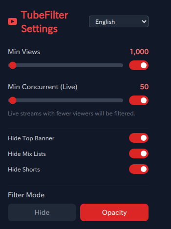
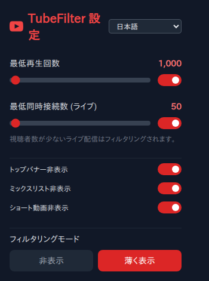

# TubeFilter

[English](./README.md) · [日本語](./README.ja.md) · [Español](./README.es.md) · [Português](./README.pt.md) · [Deutsch](./README.de.md) · [Français](./README.fr.md) · [Русский](./README.ru.md) · [한국어](./README.ko.md) · [简体中文](./README.zh.md)

**TubeFilter** 是一个跨浏览器的 Manifest V3 扩展，它根据你设定的观看次数和直播观众数阈值过滤内容，从而清理你的 YouTube 信息流。它会淡化或隐藏低观看次数的视频和低观众数的直播，并且可以独立地剔除推广顶部横幅、Mix 列表和 Shorts。设置项保存在一个 React 弹窗里，会即时应用到已打开的 YouTube 标签页而无需刷新，弹窗界面提供 **9 种语言**（English、日本語、Español、Português、Deutsch、Français、Русский、한국어、简体中文），并带有跟随浏览器语言的 **Auto** 模式。观看次数/观众数会针对同样的 **9 种 YouTube 页面语言**以区域感知的方式进行解析。

[](https://wxt.dev/)
[](https://react.dev/)
[](https://www.typescriptlang.org/)
[](https://tailwindcss.com/)


> **状态：** v1.0.0 — 尚未发布到 Chrome 网上应用店或 AMO。请通过本地解压构建安装（参见 [Installation](#installation-end-users)）。

## At a glance

TubeFilter 会隐藏或淡化低于你设定的观看次数/观众数阈值的 YouTube 信息流条目，并可按需剔除横幅、Mix 列表和 Shorts。三步即可试用：

1. `npm ci`
2. `npm run build`（Chrome）或 `npm run build:firefox`（Firefox）
3. 从 `.output/chrome-mv3`（或 `.output/firefox-mv3`）加载解压后的构建 — 参见 [Installation](#installation-end-users)。

你的设置绝不会离开你的浏览器：TubeFilter 仅请求 `storage` 权限以及对 `youtube.com` 的主机访问权限，所有配置都保存在本地浏览器存储中。

## Features

### View-count filter (regular videos)

当**以下所有条件**都满足时，一个普通视频会被过滤：

- 视频过滤器已启用（`enableVideoFilter`）。
- 成功从卡片中解析出观看次数。
- 解析出的观看次数**低于**你的 `minViews` 阈值。

如果某个视频没有可解析的观看次数，它将保持不变。弹窗中的 **Min Views** 滑块控制该阈值，当视频过滤器被关闭时它会被禁用。

### Live filter (live streams)

直播会按照一个**独立的**阈值进行评估 — 即同时在线观众数，而非总观看次数。当直播过滤器已启用（`enableLiveFilter`）、解析出了观众数、且该数值**低于**你的 `minConcurrent` 阈值时，直播会被过滤。直播状态通过 DOM 的 live-now 徽章检测，或通过观看次数字符串中表示直播的文本检测（参见 [How it works](#live-detection)）。

### Content filters (no threshold)

以下三个过滤器是无条件的开/关开关 — 它们完全忽略观看次数：

| Filter | Setting | What it removes |
|---|---|---|
| **Top Banner** | `enableBannerFilter` | 推广的页眉广告以及声明/推广横幅。当匹配到的横幅位于某个 rich 区块内部时，整个父区块都会被隐藏。 |
| **Mix Lists** | `enableMixFilter` | 自动生成的 Mix / 电台播放列表。 |
| **Shorts** | `enableShortsFilter` | Shorts 链接和货架。 |

### Channel rules & keyword filter

除了数值阈值之外，你还可以按频道强制允许或强制隐藏，并按标题文本隐藏 — 在弹窗中以每行一条的列表进行管理。

- **Always-hide channels**（`channelBlocklist`）— 来自这些频道的视频总是被隐藏，无论观看次数如何。
- **Always-show channels**（`channelAllowlist`）— 来自这些频道的视频永远不会被过滤（对于低于你 `minViews` 的喜爱的小型创作者很方便）。
- **Hide titles containing**（`titleKeywords`）— 隐藏标题中包含任一所列词条的视频。用斜杠包裹的条目（例如 `/spoiler.*ending/`）会被当作不区分大小写的**正则表达式**处理；否则它就是一个普通的不区分大小写的子串。

频道按 `@handle`、频道 ID 或频道名称进行**精确**匹配（因此 `mr` **不会**匹配 `@MrBeast`）。这些规则应用于单个视频 / 播放列表 / Mix 卡片，但**不**应用于聚合货架（例如 Shorts 货架），因此一个子项永远不会隐藏整行。

### Where filtering applies

内容脚本会在 YouTube 上运行，并随着你的浏览导航重新过滤 — 包括首页、搜索、订阅、观看页侧边栏推荐以及频道页 — 同时覆盖旧版渲染器和较新的 `yt-lockup-view-model` 布局。

### Filter modes: Hide vs. Opacity

**Filter Mode** 选择器决定了被过滤的视频/直播如何处理：

- **Hide** — 设置 `display: none`，将元素完全从视图中移除。
- **Opacity** — 设置 `opacity: 0.1`，将元素淡化到 **10%** 不透明度，同时保持可见。这是默认值。

> ℹ️ 无论选择哪种过滤模式，Top Banner 过滤器都始终隐藏横幅（`display: none`）。过滤模式仅影响视频和直播。

### Filter precedence

每张卡片只分类一次，使用固定的 if/else 顺序。只有第一个匹配类别的规则会生效：

1. **Channel blocklist** — 始终隐藏（最高优先级）
2. **Channel allowlist** — 始终显示（跳过下面的每条规则）
3. **Title keyword** — 隐藏匹配的标题
4. **Shorts**
5. **Mix lists**
6. **Live streams**
7. **Regular videos**

（频道/关键词规则 1–3 仅应用于单个卡片，而非聚合货架。）

### Disable auto-dubbing (force original audio)

YouTube 的自动配音会根据你的界面语言，用一条 AI 翻译的音轨替换视频的音频 — 因此一个英文视频默认会以日语、德语等播放。启用 **Force Original Audio**（`forceOriginalAudio`，**默认开启**）后，TubeFilter 会检测原始音轨，并在每个视频和 Short 上自动将播放器切换到它，从而撤销自动配音。

- 在 `/watch` 视频和 Shorts 上生效，并在每次应用内导航时重新应用。
- 原始音轨通过解码播放器的音轨 id 以**与语言无关**的方式识别（原始音轨的数据包含 `original`；配音音轨包含 `dubbed` / `dubbed-auto`）。
- 通过注入到页面中的 **MAIN-world 脚本**实现 — YouTube 播放器的音频 API 无法从隔离的内容脚本环境访问 — 而该设置则从扩展的存储桥接而来。
- 随时可在弹窗中将其关闭，以保留 YouTube 的配音音频。

### Multi-language view-count detection

YouTube **在不同页面语言下对观看次数和观众数的呈现方式差异很大** — 不仅是翻译后的词语，还包括不同的小数/千位分隔符以及缩写单位。同样约 17 亿的数字会显示为：

| Language | YouTube string |
|---|---|
| English | `1.7B` |
| Deutsch | `1,7 Mrd.` |
| 日本語 | `17億` |
| Русский | `1,7 млрд` |
| 简体中文 | `17亿` |

内容脚本会自动检测 **YouTube 页面语言**（`document.documentElement.lang`），并使用该区域对应的正确小数分隔符、千位分隔符和缩写单位来解析数字。这一点很重要，因为之前的解析器假定的是英语风格的格式，从而**误读了使用逗号作小数点的区域**（`de` / `fr` / `ru` / `pt`）— 例如把 `1,7 Mrd.` 读成 `1` 或 `17`，而不是 `1,700,000,000`。**9 种语言**支持区域正确的解析（参见 [Internationalization](#internationalization)）；未知的页面语言会回退到一个宽松的通用解析器。

### Languages (popup UI)

弹窗界面提供 **9 种语言** — English、日本語、Español、Português、Deutsch、Français、Русский、한국어、简体中文 — 外加一个跟随浏览器界面语言的 **Auto（`auto`，默认）** 模式（`navigator.language`，映射到最接近的受支持区域，并回退到英语）。弹窗页眉中的下拉菜单可在它们之间切换。

## Screenshots

| English | 日本語 |
|---|---|
|  |  |

## Supported browsers

| Browser | Manifest | Notes |
|---|---|---|
| **Chrome / Chromium** | MV3 | 默认构建目标；Chrome 默认即为 MV3。 |
| **Firefox** | MV3 | 输出目录为 `.output/firefox-mv3`；通过 `wxt.config.ts` 中的 `manifestVersion: 3` 强制使用 MV3（否则 Firefox 会默认使用 MV2）。 |

> ℹ️ 内容脚本在两种浏览器中都运行于 `https://www.youtube.com/*`。Firefox 构建带有值为 `tube-filter@coil398.github.io` 的 `browser_specific_settings.gecko.id`（AMO MV3 所必需，对 Chrome 无害）。

## Installation (end users)

完整且受支持的发布与安装步骤，请参见 **[RELEASE_GUIDE.md](./RELEASE_GUIDE.md)**。

要加载本地解压构建以进行测试：

### Chrome / Chromium

1. 运行 `npm run build` 以生成 `.output/chrome-mv3`。
2. 打开 `chrome://extensions`。
3. 启用**开发者模式**（右上角）。
4. 点击**加载已解压的扩展程序**，并选择 `.output/chrome-mv3` 目录。

### Firefox

1. 运行 `npm run build:firefox` 以生成 `.output/firefox-mv3`。
2. 打开 `about:debugging`。
3. 前往 **This Firefox** → **Load Temporary Add-on…**。
4. 选择 `.output/firefox-mv3` 目录内的任意文件（例如其 `manifest.json`）。

## Usage

打开扩展弹窗以调整过滤。更改会立即保存，并实时应用到任何已打开的 YouTube 标签页 — 无需刷新。

### Settings reference

| Setting | What it controls | Range / step | Default | JA label | EN label |
|---|---|---|---|---|---|
| `minViews` | 普通视频低于此观看次数即被过滤的最小值 | range `0`–`100000`, step `1000` | `1000` | 最低再生回数 | Min Views |
| `minConcurrent` | 直播低于此同时观众数即被过滤的最小值 | range `0`–`5000`, step `50` | `50` | 最低同時接続数 (ライブ) | Min Concurrent (Live) |
| `filterMode` | 被过滤的视频/直播如何处理（`hide` / `opacity`） | two-button selector | `opacity` | フィルタリングモード | Filter Mode |
| `enableVideoFilter` | 启用/禁用观看次数过滤器（同时启用/禁用 Min Views 滑块） | on/off toggle | `true` | 動画フィルタ有効 | Enable Video Filter |
| `enableLiveFilter` | 启用/禁用直播过滤器（同时启用/禁用 Min Concurrent 滑块） | on/off toggle | `true` | ライブフィルタ有効 | Enable Live Filter |
| `enableBannerFilter` | 隐藏推广顶部横幅 | on/off toggle | `true` | トップバナー非表示 | Hide Top Banner |
| `enableMixFilter` | 隐藏 Mix 列表 | on/off toggle | `true` | ミックスリスト非表示 | Hide Mix Lists |
| `enableShortsFilter` | 隐藏 Shorts | on/off toggle | `true` | ショート動画非表示 | Hide Shorts |
| `forceOriginalAudio` | 在观看页和 Shorts 上强制使用原始音轨（撤销自动配音） | on/off toggle | `true` | 元の音声に固定 | Force Original Audio |
| `channelAllowlist` | 永不过滤（始终显示）的频道，每行一个；按 @handle、ID 或名称匹配 | textarea list | `[]` | 常に表示するチャンネル | Always-show channels |
| `channelBlocklist` | 始终隐藏的频道，每行一个 | textarea list | `[]` | 常に非表示のチャンネル | Always-hide channels |
| `titleKeywords` | 隐藏标题中包含某词条的视频；`/…/` 条目为不区分大小写的正则 | textarea list | `[]` | この語を含むタイトルを非表示 | Hide titles containing |
| `language` | 弹窗界面语言：`auto` + 9 种区域（`en`/`ja`/`es`/`pt`/`de`/`fr`/`ru`/`ko`/`zh`）；**Auto** 跟随浏览器界面语言（`navigator.language`） | dropdown selector | `auto` | Language | 言語 |

两个滑块都通过 `toLocaleString()` 以千位分隔的形式显示其数值。在 Min Concurrent 滑块下方有一条辅助提示：

- JA: 視聴者数が少ないライブ配信はフィルタリングされます。
- EN: Live streams with fewer viewers will be filtered.

### Filter-mode selector

一个双按钮控件。**Hide** 设置 `filterMode = 'hide'`；**Opacity** 设置 `filterMode = 'opacity'`。当前激活的模式会高亮显示。标签已本地化 — JA: 非表示 / 薄く表示，EN: Hide / Opacity。

### Language selector

弹窗页眉中的下拉菜单将 `language` 设置为 `auto` 或 9 种区域之一（`en`/`ja`/`es`/`pt`/`de`/`fr`/`ru`/`ko`/`zh`）。**Auto**（默认）会从 `navigator.language` 解析出有效的界面语言，映射到最接近的受支持区域并回退到英语。选择某个特定语言会将界面固定为该语言，无论浏览器设置如何。

## How it works

### Content script

- **Match & timing** — 匹配 `https://www.youtube.com/*` 并在 `run_at: document_end` 时运行。
- **Page-language detection** — 在每一遍处理中读取 `document.documentElement.lang`（回退到 `navigator.language`，再到 `'en'`），并据此选择一个区域正确的观看次数解析器（参见 [Internationalization](#internationalization)）。
- **Targets** — 扫描覆盖首页（`ytd-rich-item-renderer`）、搜索（`ytd-video-renderer`）、侧边栏（`ytd-compact-video-renderer`）、频道（`ytd-grid-video-renderer`）、Mix 列表（`ytd-radio-renderer`）、单个 Shorts（`ytd-reel-item-renderer`）和 Shorts 货架（`ytd-rich-shelf-renderer`）的 7 个视频选择器；外加 9 个横幅选择器（`#masthead-ad`、`#big-yoodle`、`ytd-statement-banner-renderer`、`ytd-banner-promo-renderer`、`ytd-ad-slot-renderer`、`ytd-in-feed-ad-layout-renderer`，以及若干 `ytd-rich-section-renderer > #content > …` 变体）。
- **Dynamic feed handling** — 一个 `MutationObserver` 以 `{ childList: true, subtree: true }` 监视 `document.body`。当有节点被添加时，它会用一个 **500 ms** 的 `setTimeout` 进行防抖（每批都会清除并重新设置该计时器），因此过滤会在最后一批添加节点之后 500 ms 运行。过滤器还会在初次加载时运行一次，并在设置加载后立即再运行一次。

  > ℹ️ 这是一个尾随防抖（trailing debounce），而非固定的节流（throttle）：在持续的变动下，这一遍会不断被推迟。（源代码自身的内联注释 `// Run at most every 500ms` 描述的是节流，略有不准确。）
- **Mix / Shorts detection** — Mix 列表通过 `start_radio=1`、`list=RD`、`MIX` 叠加徽章或 `ytd-radio-renderer` 匹配；Shorts 通过 `/shorts/` 链接、`SHORTS` 叠加徽章、`ytd-reel-item-renderer` 以及 `ytd-rich-shelf-renderer` 货架匹配。
- **Banner parent-section hiding** — 当匹配到的横幅存在 `closest('ytd-rich-section-renderer')` 祖先时，会隐藏整个父区块，而不仅仅是内部横幅。

<a id="live-detection"></a>

直播状态通过 DOM 徽章（`.badge-style-type-live-now`、`.badge-style-type-live-now-alternate`、`[overlay-style="LIVE"]`）检测，或通过观看次数文本本身检测（不区分大小写地包含 `視聴中`、`watching`、`live` 或 `ライブ`，外加当前页面区域自身的直播关键词 — 参见 [Internationalization](#internationalization)）。

<a id="internationalization"></a>

### Internationalization

YouTube 在每种界面语言下对观看次数/观众数的格式化方式都不同，因此数字解析由**检测到的 YouTube 页面语言**驱动，而非由弹窗界面语言驱动。在每一遍处理中，内容脚本读取 `document.documentElement.lang`（回退到 `navigator.language`，再到 `'en'`），将其规范化为基础语言代码（例如 `zh-Hans-CN` → `zh`，`es-419` → `es`），并选择一份按区域定义的规范，该规范描述了该语言的小数分隔符、千位分隔符、缩写单位（例如 `K`/`M`/`B`、`万`/`億`、`Mio.`/`Mrd.`、`тыс.`/`млн`/`млрд`、`万`/`亿`）、"观看次数"连接词、日期/往期直播标记、直播词语，以及"无观看"→ `0` 的词语。

**9 种语言**支持区域正确的解析：

- **English**（`en`）
- **日本語**（`ja`）
- **Español**（`es`）
- **Português**（`pt`）
- **Deutsch**（`de`）
- **Français**（`fr`）
- **Русский**（`ru`）
- **한국어**（`ko`）
- **简体中文**（`zh`）

如果页面语言不属于上述任何一种，解析会回退到一份**宽松的通用规范**，它使用 `.` 作小数点，并尽力识别常见单位的并集（`K`/`M`/`B` 以及 CJK/韩语单位）。这种区域感知修复了之前解析器对使用逗号作小数点的区域（`de` / `fr` / `ru` / `pt`）的误读，即 `1,7 Mrd.` 被读成 `1` 或 `17`，而不是 `1,700,000,000`。

### Popup (React)

一个 React 19 弹窗（`src/entrypoints/popup/`）渲染滑块、开关、过滤模式选择器以及三选一的语言选择器。编辑任何控件都会立即写入存储。弹窗会从 `settings.language` 解析出其有效的显示语言：`auto` 跟随 `navigator.language`，而 `ja` / `en` 则将其固定。

### Settings storage & live sync

- 设置会以**扁平的顶层键**形式持久化到 `browser.storage.local` — 每个字段一个键（`minViews`、`minConcurrent`、`filterMode`、…）。这与 WXT 之前的 `chrome.storage.local` 形态一致，因此现有用户在迁移过程中能保留其设置。
- `loadSettings()` 调用 `browser.storage.local.get(defaultSettings)`，将已存储的值合并到默认值之上；`saveSettings()` 调用 `browser.storage.local.set(settings)`。
- `watchSettings()` 注册一个 `browser.storage.onChanged` 监听器。当 `local` 区域发生任何更改时，它会重新读取完整的设置记录并重新运行过滤器 — 这正是弹窗中的编辑能即时应用到已打开标签页的原因。

`Settings` 类型恰好有 9 个字段：`minViews`、`minConcurrent`、`filterMode`、`enableVideoFilter`、`enableLiveFilter`、`enableBannerFilter`、`enableMixFilter`、`enableShortsFilter`、`language`（`'auto' | 'ja' | 'en'`，默认 `'auto'`）。

### View-count parsing

`parseViewCount(text, lang)` 为给定的页面语言解析出区域规范（语言未知/省略时则使用通用规范），并将 YouTube 各式各样的数字字符串规范化为一个数字（或 `null`）。在所有受支持的区域中，它会：

| Input pattern | Handling | Example |
|---|---|---|
| Abbreviation units (per locale) | 乘以该区域的单位系数 | `1.2万` → `12000`, `12K` → `12000`, `1,7 Mrd.` (de) → `1700000000` |
| Locale decimal / thousands separators | 使用逗号作小数点的区域（`de`/`fr`/`ru`/`pt`）和使用空格作千位分隔的区域（`fr`/`ru`）都能正确解析 | `129.069 Aufrufe` (de) → `129069` |
| "No views" words (e.g. `No views`, `なし`, locale equivalents) | 返回 `0` | `No views` → `0` |
| Plain numbers | 按区域剥离分隔符后再解析 | `1,234` (en) → `1234` |
| Date / past-stream text | 视为"非计数"，因此该卡片保持不变 | `2 days ago`, `〜前` |
| Unparseable | 返回 `null`（元素不被观看次数规则过滤） | — |

在解析之前，会先剥离该区域的"观看次数"/连接词关键词（例如 `views` / `view` / `回視聴` / `視聴` / `回` / `de vistas` / `Aufrufe` / `просмотров` / `조회수` / `次观看`）。空白字符 — 包括真实 YouTube 字符串中出现的 NBSP 和 narrow-NBSP — 会被首先规范化。当文本包含一个通用直播标记（`視聴中`、`watching`、`live`、`ライブ`）或当前区域的某个直播词语时，`isLive(text, lang)` 辅助函数会返回 `true`（不区分大小写）。

## Known limitations

> ⚠️ `src/utils/filter.ts` 中的调试日志目前被硬编码为开启（`const debug = true`），因此内容脚本会输出冗长的控制台日志。`FILTERED` 摘要日志是无条件输出的 — 它位于 `debug` 守卫之外 — 因此即使该标志被关闭它也会出现。

## Development

### Prerequisites

- **Node.js 20**（CI 所使用的版本）。
- npm（仓库附带 `package-lock.json`）。

### Install

```bash
npm ci   # postinstall runs `wxt prepare` to generate WXT-managed types (.wxt/)
```

### npm scripts

| Script | Command | What it does |
|---|---|---|
| `dev` | `wxt` | 启动针对 Chrome（默认目标）并带 HMR 的 WXT 开发服务器。 |
| `dev:firefox` | `wxt -b firefox` | 启动针对 Firefox 的 WXT 开发服务器。 |
| `build` | `wxt build` | 针对 Chrome 的生产构建 → `.output/chrome-mv3`。 |
| `build:firefox` | `wxt build -b firefox` | 针对 Firefox 的生产构建 → `.output/firefox-mv3`。 |
| `zip` | `wxt zip` | 构建并将 Chrome 扩展打包成 `.output/` 中可分发的 zip。 |
| `zip:firefox` | `wxt zip -b firefox` | 构建并将 Firefox 扩展 zip 打包到 `.output/`。 |
| `compile` | `wxt prepare && tsc --noEmit` | 生成 WXT 类型，然后进行不输出文件的类型检查。 |
| `lint` | `eslint .` | 对整个项目进行 lint（ESLint 9 flat config，位于 `eslint.config.js`）。 |
| `test` | `tsx test-parser.ts` | 运行区域观看次数解析器测试（`test-parser.ts`），覆盖全部 9 种受支持语言的观看次数/观众数解析和直播检测。 |

> ℹ️ 在 `npm install` / `npm ci` 之后，`postinstall` 会自动运行 `wxt prepare`。

在更改 `src/utils/locales.ts` 或 `src/utils/parser.ts` 中的任何内容后请运行 `npm test` — 它会断言真实的 YouTube 数字字符串（包括以 NBSP 分隔和以逗号作小数点的形式）能为 English、日本語、Español、Português、Deutsch、Français、Русский、한국어 和 简体中文 解析为预期的数字。

### Project structure

```text
TubeFilter/
├── src/
│   ├── entrypoints/
│   │   ├── content/
│   │   │   └── index.ts        # Content script: matches youtube.com, runs at document_end
│   │   └── popup/
│   │       ├── App.tsx          # React 19 popup UI
│   │       ├── main.tsx
│   │       ├── index.html
│   │       └── index.css
│   └── utils/
│       ├── filter.ts            # processVideoElement, processBannerElement
│       ├── parser.ts            # parseViewCount, isLive (locale-aware wrappers)
│       ├── locales.ts           # per-language LocaleSpec table + generic fallback, detectLang/parseCount
│       ├── storage.ts           # defaultSettings, loadSettings, watchSettings
│       └── types.ts             # Settings type
├── public/
│   └── icon/                    # 16.png, 48.png, 128.png
├── test-parser.ts               # `npm test` — locale parser tests for all 9 languages
├── wxt.config.ts                # srcDir: 'src', React module, manifestVersion: 3, manifest fields
├── tsconfig.json                # extends .wxt/tsconfig.json
├── eslint.config.js
├── postcss.config.js
├── tailwind.config.js
├── package.json
├── README.md
└── RELEASE_GUIDE.md
```

WXT 的配置使用 `srcDir: 'src'` 和 `modules: ['@wxt-dev/module-react']`。共享逻辑通过 `@/utils/...` 别名导入。manifest 声明了 `permissions: ['storage']` 和 `host_permissions: ['https://www.youtube.com/*']`，其 `name: 'TubeFilter'`，描述为 "Filter YouTube videos based on views and other metrics."。`wxt.config.ts` 中的 `manifestVersion: 3` 是强制两个目标都输出 MV3 的唯一事实来源。

`tsconfig.json` 扩展了 WXT 生成的 `./.wxt/tsconfig.json`，并添加了 `jsx: 'react-jsx'`、`allowImportingTsExtensions`、`noUnusedLocals`、`noUnusedParameters` 和 `noFallthroughCasesInSwitch`。

## Build and release

### Build outputs

| Target | Output directory |
|---|---|
| Chrome | `.output/chrome-mv3` |
| Firefox | `.output/firefox-mv3` |

### Zip artifacts

`wxt zip` 使用 WXT 默认的 zip 文件名模板（`{{name}}-{{version}}-{{browser}}.zip`，其中 `{{name}}` 是 `package.json` 名称 `tube-filter`）将构建打包到 `.output/`。`wxt.config.ts` 中未设置自定义的 `zipFileName`/`sources` 模板，因此下面的名称遵循 WXT 默认值：

- `tube-filter-<version>-chrome.zip`（例如 `tube-filter-1.0.0-chrome.zip`）— 由发布工作流的上传 glob 印证。
- `tube-filter-<version>-firefox.zip`（例如 `tube-filter-1.0.0-firefox.zip`）— 由发布工作流的上传 glob 印证。
- 用于 AMO 审核的 sources zip（WXT 针对 Firefox 目标的默认产物，通常为 `tube-filter-<version>-sources.zip`）。该名称是 WXT 默认值，仓库中没有任何代码引用它；运行 `npm run zip:firefox` 以确认你环境中的确切文件名。

### GitHub Actions release workflow

`.github/workflows/release.yml`（名为 **Release**）在 GitHub 的 `release` 事件且 `types: [published]` 时触发，并具有 `permissions: contents: write`。该作业在 `ubuntu-latest` 上运行，并：

1. 检出代码（`actions/checkout@v4`）。
2. 设置 **Node.js 20** 并启用 npm 缓存（`actions/setup-node@v4`）。
3. 运行 `npm ci`（其 `postinstall` 会运行 `wxt prepare`）。
4. 运行 `npm run zip`（Chrome）和 `npm run zip:firefox`（Firefox），生成两个浏览器的 zip。
5. 通过 `softprops/action-gh-release@v2` 将它们作为发布资产上传（由 `startsWith(github.ref, 'refs/tags/')` 守卫），匹配 `.output/tube-filter-*-chrome.zip` 和 `.output/tube-filter-*-firefox.zip`。

## Tech stack

| Technology | Version |
|---|---|
| [WXT](https://wxt.dev/) | `^0.20.26` |
| [React](https://react.dev/) + React DOM | `^19.2.0` |
| [TypeScript](https://www.typescriptlang.org/) | `~5.9.3` |
| [Tailwind CSS](https://tailwindcss.com/) | `^3.4.18` |
| `@wxt-dev/module-react` | `^1.2.2` |
| ESLint | `^9.39.1` |
| `typescript-eslint` | `^8.46.4` |
| autoprefixer | `^10.4.22` |
| postcss | `^8.5.6` |

该包为 `tube-filter` v`1.0.0`（`private`，ESM `"type": "module"`）；扩展显示名称在 `wxt.config.ts` 中被覆盖为 **TubeFilter**。

## Contributing

欢迎贡献。在提交 PR 之前：

1. `npm ci` 以安装依赖（这也会生成 WXT 类型）。
2. `npm run lint` 以用 ESLint 检查代码。
3. `npm run compile` 以进行类型检查（`wxt prepare && tsc --noEmit`）。
4. `npm test` 以运行区域解析器测试（尤其是在改动 `src/utils/locales.ts` 或 `src/utils/parser.ts` 之后）。
5. 用 `npm run dev` 和 `npm run dev:firefox` 在两个目标中测试你的更改。

## License

本项目未指定任何许可证，仓库中也没有 `LICENSE` 文件。在缺少明确许可证的情况下，代码默认为**保留所有权利**（all rights reserved）— 你没有权限重用、再分发或修改它。如果你打算开放它，请添加一个声明条款的 `LICENSE` 文件。
